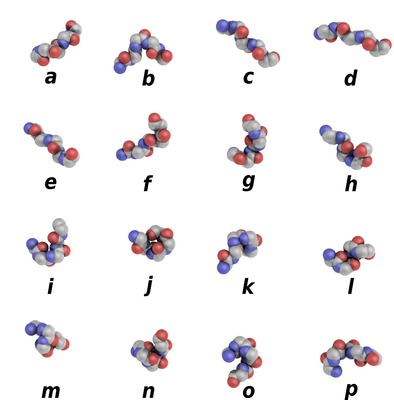

**PBxplore** is a suite of tools dedicated to Protein Block analysis. Protein Blocks are structural prototypes defined by [de Brevern](http://www.dsimb.inserm.fr/~debrevern/index.php) *et al* [1]. Their main interest is to modelize the 3-dimensional local structure of the protein backbone into a 1-dimension sequence. In principle, any conformation of any amino acid could be represented by one of the sixteen available Protein Blocks (see Figure 1).

**Figure 1.** Schematic representation of the sixteen protein blocks, labeled from *a* to *p* (Creative commons CC BY).

# Download

# Requirements
PBxplore requires at least Python 2.6, the [NumPy](http://numpy.scipy.org/ "NumPy") Python library and R.

# Documentation

Further documentation is available :

* [Introduction to Protein Blocks](doc/intro.PBs.md)
* [Single structure analysis](doc/single.structure.analysis.md)
* [Multiple conformation analysis](doc/multiple.conformation.analysis.md)

# References
[1] A. G. de Brevern, C. Etchebest and S. Hazout. Bayesian probabilistic approach for predicting backbone structures in terms of protein blocks. *Proteins* **41**: 271-288 (2000).
