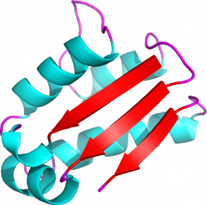

Protein Blocks
==============

Protein Blocks (PBs) are structural prototypes defined by `de Brevern <http://www.dsimb.inserm.fr/~debrevern/index.php>`_ *et al* in 2000 [#]_.
The 3-dimensional local structure of a protein backbone can be modelized as an 1-dimensional sequence of PBs. In principle, any conformation of any amino acid could be represented by one of the sixteen available Protein Blocks.

PBs are labeled from a to p (see :ref:`PB-fig`): the PBs *m* and *d* can be roughly described as prototypes for alpha-helix and central beta-strand, respectively. PBs **a** to **c** primarily represent beta-strand N-caps and PBs **e** and **f**, beta-strand C-caps; PBs **a** to **j** are specific to coils, PBs **k** and **l** to alpha-helix N-caps, and PBs **n** to **p** to alpha-helix C-caps.

.. _PB-fig:
.. figure:: img/PBs.jpg
    :align: center

    Figure 1

    Schematic representation of the sixteen protein blocks, labeled from *a* to *p*
    (Creative commons CC-BY).

.. _pdb_1AY7:

    Figure 2

    3D representation of the barstar protein (PDB ID `1AY7 <http://www.rcsb.org/pdb/explore/explore.do?pdbId=1AY7>`_, chain B)
    (Creative commons CC-BY).

For instance, the 3D structure of the barstar protein represented in :ref:`pdb_1AY7` can be translated in a 1D-sequence of Protein Blocks: ::

    ZZdddfklpcbfklmmmmmmmmnopafklgoiaklmmmmmmmmpacddddddehkllmmmmnnommmmmmmmmmmmmmnopacddddZZ

The conformations of the 89 residues of the barstar are translated into a sequence of 89 protein blocks. Note that "Z" corresponds to amino acids for which a protein block cannot be assigned. As a matter of fact, the assignment of a given residue *n* requires is based on the conformations of residues *n-1*, *n-1*, *n*, *n+1* and *n+2*. Therefore, a protein block cannot be assigned to the two first (N-termini) and two last (C-termini) residues of a polypeptide chain.

.. _Neq:

Neq
---

*Neq* is calculated as follows:

.. _Neq-fig:
.. figure:: img/Neq.jpg
    :align: center

    Figure 3

    Neq formula

Where **fx** is the probability of PB **x**. **Neq** quantifies the average number of PBs
at a given position in the protein sequence.
A **Neq** value of 1 indicates that only one type of PB is observed,
while a value of 16 is equivalent to a random distribution.

.. [#] A. G. de Brevern, C. Etchebest, and S. Hazout. Bayesian Probabilistic Approach for Predicting Backbone Structures in Terms of Protein Blocks. *Proteins* **41**:271-87 (2000).
