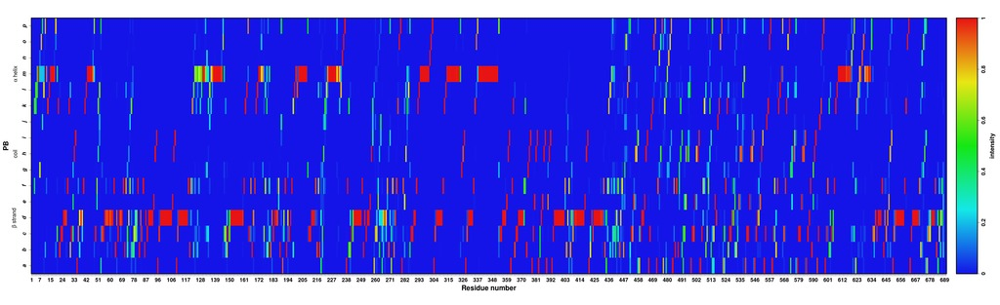
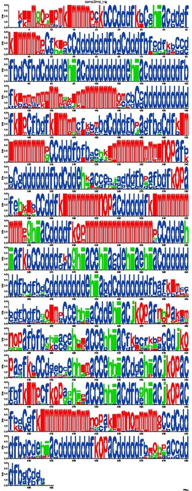
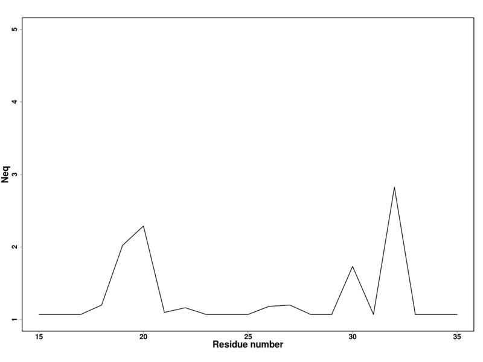
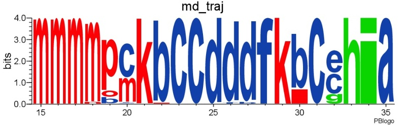

# Multiple conformation analysis #

The PBs assignment of several conformations (generated by molecular dynamics or whatever method you want) of the same protein can be analyzed statistically. Such analysis is a two-steps process:

1. `PBcount.py` computes the frequency of PBs at each position along the amino acid sequence
2. `PBstat.py` generates frequency and logo plots and estimates something similar to entropy called the equivalent number of PBs (_Neq_). *Neq* est calculated as follows:

Where *fx* is the probability of PB *x*. *Neq* quantifies the average number of PBs at a given position in the protein sequence. A *Neq* value of 1 indicates that only one type of PB is observed, while a value of 16 is equivalent to a random distribution. 

----

## `PBcount.py`

For this example, first perform the PB assignment (with `PBassign.py`):

    ./PBassign.py -p ./demo2/md_traj.pdb -o md_traj

Output:

    1 PDB file(s) to process
    read PB definitions: 16 PBs x 8 angles 
    demo2/md_traj.pdb
    PBs assigned for demo2/md_traj.pdb | model 0
    PBs assigned for demo2/md_traj.pdb | model 1
    PBs assigned for demo2/md_traj.pdb | model 2
    PBs assigned for demo2/md_traj.pdb | model 3
    [snip]
    PBs assigned for demo2/md_traj.pdb | model 221
    PBs assigned for demo2/md_traj.pdb | model 222
    PBs assigned for demo2/md_traj.pdb | model 223
    PBs assigned for demo2/md_traj.pdb | model 224
    wrote md_traj.PB.fasta

Then compute PBs frequency:

    ./PBcount.py -f md_traj.PB.fasta -o md_traj

Output:

    read 225 sequences in md_traj.PB.fasta
    wrote md_traj.PB.count

Content of `md_traj.PB.count`:

             a     b     c     d     e     f     g     h     i     j     k     l     m     n     o     p
    1        0     0     0     0     0     0     0     0     0     0     0     0     0     0     0     0
    2        0     0     0     0     0     0     0     0     0     0     0     0     0     0     0     0
    3        0     0     0     0     0    98     0     0     0     0   127     0     0     0     0     0
    4        0     0     0     0     0     0     0     0     0     0   101   124     0     0     0     0
    5        0     0     0     0     0     0     0     0     0     0     1   118   106     0     0     0
    6        0     0     0     0     0     0     0     0     0     0     0     0   224     1     0     0
    7        0     0     0     0     0     0   158     0     0     0     0     0    47    20     0     0
    8        0     0     0     0     0     0     0     0     0     0     0     0    46     0   179     0
    9        0     0     0     0     0     0     0     0     0    76     2     0    48     0     0    99
    [snip]

| `PBcount.py` options                                                                            ||
|-----------------------|--------------------------------------------------------------------------|
| `-h` or `--help`      | shows help message                                                       |
| `--version`           | shows program version                                                    |
| `-f` **(mandatory)**  | defines the name of the file that contains PBs sequences in fasta format |
| `-o` **(mandatory)**  | defines root name for results (do not specify any extension)             |
| `--residue-shift`     | shift to adjust residue number                                           |

### `-f` option

can be used several times:

    ./PBcount.py -f demo2/md_traj_1.PB.fasta -f demo2/md_traj_2.PB.fasta -f demo2/md_traj_3.PB.fasta -o test

Output:

    read 90 sequences in demo2/md_traj_1.PB.fasta
    read 90 sequences in demo2/md_traj_2.PB.fasta
    read 90 sequences in demo2/md_traj_3.PB.fasta
    wrote test.PB.count

### `--residue-shift` option

Since the index of the first residue is always 1, this option allows to adjust its index.

    ./PBcount.py --residue-shift 5 -f demo2/md_traj_1.PB.fasta -o test1

Output:

    read 90 sequences in demo2/md_traj_1.PB.fasta
    first residue will be numbered 6
    wrote test1.PB.count

Content of `test1.PB.count`:

             a     b     c     d     e     f     g     h     i     j     k     l     m     n     o     p
    6        0     0     0     0     0     0     0     0     0     0     0     0     0     0     0     0
    7        0     0     0     0     0     0     0     0     0     0     0     0     0     0     0     0
    8        0     0     0     0     0    90     0     0     0     0     0     0     0     0     0     0
    9        0     0     0     0     0     1     0     0     0     0    89     0     0     0     0     0
    10       0    89     0     0     0     0     0     0     0     0     0     1     0     0     0     0
    11       0     0    86     0     0     3     0     0     0     0     0     0     1     0     0     0
    12       0     0     1     0     0     7     4     0     0     0     0     0     0    78     0     0
    13       0    48     0     0     0     0     0     9     0     0     0     7     0     0    26     0
    [snip]

----

## `PBstat.py`

generates frequency and logo plots and estimates *Neq*. 

    ./PBstat.py -f md_traj.PB.count --map --neq --logo -o md_traj

Output:

    wrote md_traj.PB.map.png

    wrote md_traj.PB.Neq
    wrote md_traj.PB.Neq.png

    wrote md_traj.PB.logo.pdf

| `PBstat.py` options                                                                                             ||
|-----------------------|------------------------------------------------------------------------------------------|
| `-h` or `--help`      | shows help message                                                                       |  
| `--version`           | shows program version                                                                    |
| `-f` **(mandatory)**  | defines the name of the file that contains PBs frequency (count)                         |
| `-o` **(mandatory)**  | defines root name for results (do not specify any extension)                             |
| `--map`               | generates map of the distribution of PBs along protein sequence                          |
| `--neq`               | computes Neq and generates Neq plot along protein sequence                               |
| `--logo`              | generates logo representation of PBs frequency along protein sequence (requires Weblogo) |
| `--residue-min`       | defines lower bound of residue frame                                                     |
| `--residue-max`       | defines upper bound of residue frame                                                     |

The file named `*.PB.Neq` contains the *Neq* value along the protein sequence. Output example:

    resid      Neq 
    1          1.00 
    2          1.00 
    3          1.98 
    4          1.99 
    5          2.05 
    6          1.03 
    7          2.20 
    8          1.66 
    9          3.00 
    [snip]

Note that the first column in `*.PB.Neq` and `*.PB.count` files provides a residue id that is not equivalent to the residue number in the PDB file, i. e. the first residue of the protein sequence *always* has id 1. 

### `--map` option

generates map of the distribution of PBs along protein sequence.

Example:

    ./PBstat.py -f demo2/md_traj.PB.count --map -o md_traj

Output:

    wrote md_traj.PB.map.png

Graph:

### `--neq` option

computes _Neq_ and generates _Neq_ plot along protein sequence.

Example:

    ./PBstat.py -f demo2/md_traj.PB.count --neq -o md_traj

Output:

    wrote md_traj.PB.Neq
    wrote md_traj.PB.Neq.png

Content of `md_traj.PB.Neq`:

    resid       Neq 
    1          1.00 
    2          1.00 
    3          1.99 
    4          2.00 
    5          2.06 
    6          1.04 
    7          2.21 
    8          1.67 
    [snip]

Graph:

### `--logo` option

generates logo representation of PBs frequency along protein sequence. This option requires Weblogo to be installed.

Example:

    ./PBstat.py -f demo2/md_traj.PB.count --logo -o md_traj

Output:

    wrote md_traj.PB.logo.pdf

Graph:

### `--residue-min` and `--residue-max` options

These options define the lower and upper bound of residue frame. 

    ./PBstat.py -f md_traj.PB.count --map --neq --logo -o md_traj --residue-min 15 --residue-max 35

Output:

    wrote md_traj.PB.map.15-35.png

    wrote md_traj.PB.Neq.15-35
    wrote md_traj.PB.Neq.15-35.png

    wrote md_traj.PB.logo.15-35.pdf

PBs distribution:

Neq versus residue number:

Logo representation of PBs frequency:

