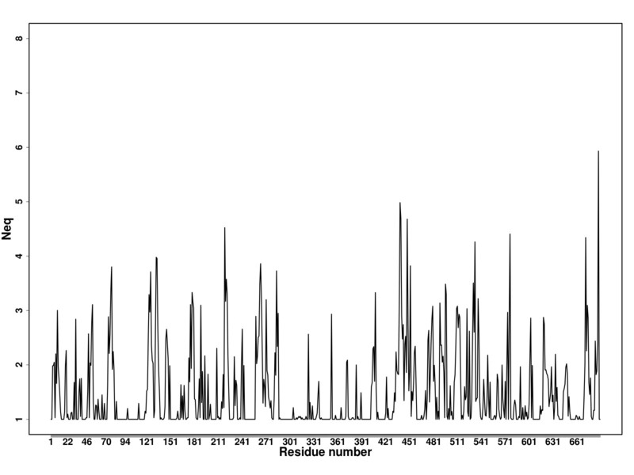
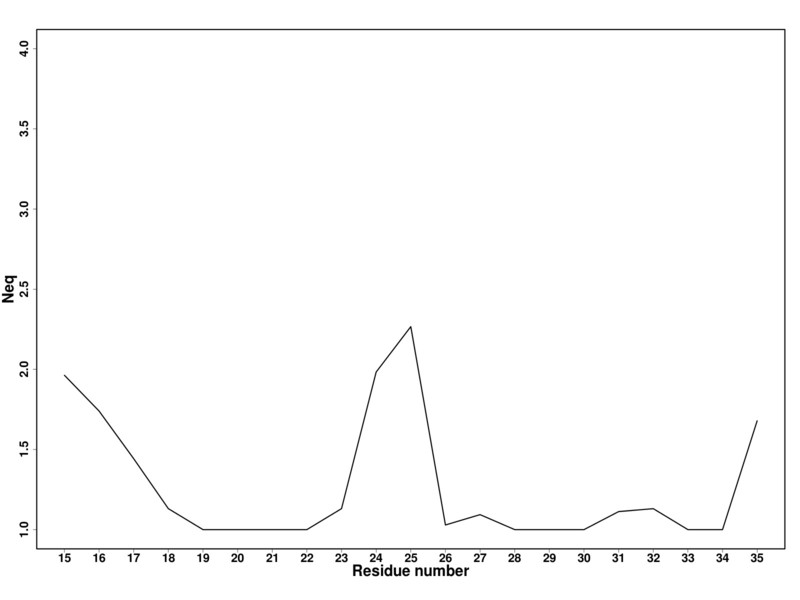

# Multiple conformation analysis #

The PBs assignments of several conformations (generated by molecular dynamics or whatever method you want) of the same protein can be analyzed statistically. Such analysis is performed by the `PBstat.py` tool that computes the frequency of PBs at each position along the amino acid sequence and then estimates something similar to entropy called the equivalent number of PBs (*Neq*). *Neq* est calculated as follows:

Where *fx* is the probability of PB *x*. *Neq* quantifies the average number of PBs at a given position in the protein sequence. A *Neq* value of 1 indicates that only one type of PB is observed, while a value of 16 is equivalent to a random distribution. 

Example:

    ./PBstat.py -f ./demo2/md_traj.PB.fasta -o md_traj

Output:

    read 225 sequences in ./demo2/md_traj.PB.fasta
    wrote md_traj.PB.count
    wrote md_traj.PB.Neq
    wrote md_traj.PB.Neq.png

| `PBstat.py` options                                                                             ||
|-----------------------|--------------------------------------------------------------------------|
| `-h` or `--help`      | shows help message                                                       |
| `--version`           | shows program version                                                    |
| `-f` **(mandatory)**  | defines the name of the file that contains PBs sequences in fasta format |
| `-o` **(mandatory)**  | defines root name for results (do not specify any extension)             |
| `--neq-residue-lower` | defines lower bound for Neq display                                      |
| `--neq-residue-upper` | defines upper bound for Neq display                                      |
| `--neq-residue-shift` | shift to adjust residue number                                           |
| `--no-neq`            | disables Neq display                                                     |

## `-f` option
can be used several times. For instance:

    ./PBstat.py -f demo2/md_traj_1.PB.fasta -f demo2/md_traj_2.PB.fasta -f demo2/md_traj_3.PB.fasta -o test_output

Statistics are computed based on the three PBs files (`md_traj_1.PB.fasta`, `md_traj_2.PB.fasta` and `md_traj_3.PB.fasta`) and then written in the same output files. The files `test1.PB.fasta`, `test2.PB.fasta` and `test3.PB.fasta` must described the very same protein (in different conformations).

Note: unlike `PBassign.py`, `PBstat.py` cannot take a directory as an input. Individual fasta files must to be specified.

## `-o` option
defines root name (with no extension) for output files. 

The file named `*.PB.count` contains counts of each PB at each position along the protein sequence. Output example:

             a     b     c     d     e     f     g     h     i     j     k     l     m     n     o     p
    1        0     0     0     0     0     0     0     0     0     0     0     0     0     0     0     0
    2        0     0     0     0     0     0     0     0     0     0     0     0     0     0     0     0
    3        0     0     0     0     0    98     0     0     0     0   127     0     0     0     0     0
    4        0     0     0     0     0     0     0     0     0     0   101   124     0     0     0     0
    5        0     0     0     0     0     0     0     0     0     0     1   118   106     0     0     0
    6        0     0     0     0     0     0     0     0     0     0     0     0   224     1     0     0
    7        0     0     0     0     0     0   158     0     0     0     0     0    47    20     0     0
    8        0     0     0     0     0     0     0     0     0     0     0     0    46     0   179     0
    9        0     0     0     0     0     0     0     0     0    76     2     0    48     0     0    99
    [snip]

The file named `*.PB.Neq` contains the *Neq* value along the protein sequence. Output example:
    resid      Neq 
    1          1.00 
    2          1.00 
    3          1.98 
    4          1.99 
    5          2.05 
    6          1.03 
    7          2.20 
    8          1.66 
    9          3.00 
    [snip]

Note that the first column in `*.PB.Neq` and `*.PB.count` files provides a residue id that is not equivalent to the residue number in the PDB file, i. e. the first residue of the protein sequence *always* has id 1. 

## `--no-neq` option

By default, a png graph of the Neq versus the residu number is generated. This option disables such process

## `--neq-lower`, `--neq-upper` and `--neq-shift` options

These options allow to adjust the x-axis of the Neq graph. 

`--neq-lower` and `--neq-upper` define the frame of residues for which Neq is displayed. Remember that residue id always starts at 1.

`--neq-shift` allows to shift the display of residue number since in PBxplore residue id always starts at 1.

Example without residue frame and shift:

    ./PBstat.py -f ./demo2/md_traj.PB.fasta -o md_traj

Output:

    read 225 sequences in ./demo2/md_traj.PB.fasta
    wrote md_traj.PB.count
    wrote md_traj.PB.Neq
    wrote md_traj.PB.Neq.png

Neq graph:

Example with residue frame and shift:

    ./PBstat.py -f ./demo2/md_traj.PB.fasta -o md_traj --neq-residue-lower=10 --neq-residue-upper=30 --neq-residue-shift=5

Output:

    read 225 sequences in ./demo2/md_traj.PB.fasta
    wrote md_traj.PB.count
    wrote md_traj.PB.Neq
    wrote md_traj.PB.Neq.png

Neq graph:

