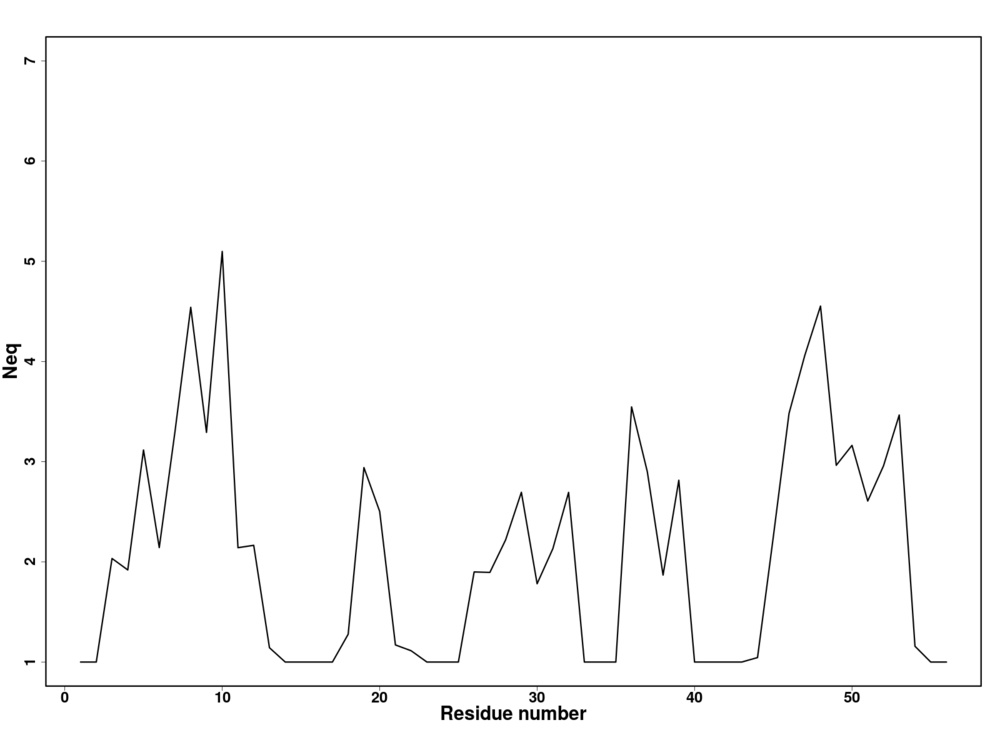
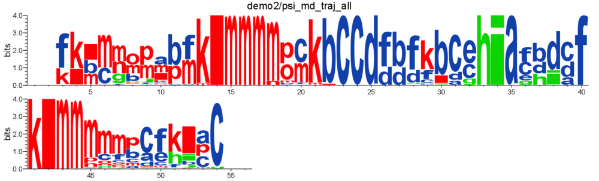
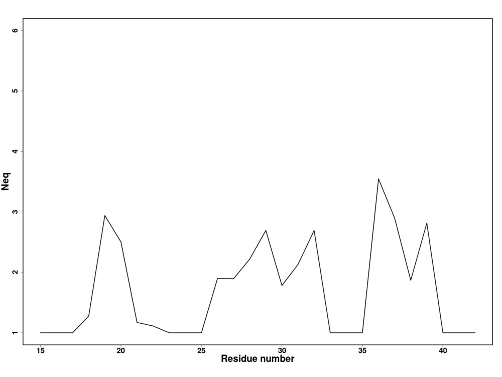

# Multiple conformation analysis #

The PBs assignment of several conformations (generated by molecular dynamics or whatever method you want) of the same protein can be analyzed statistically. Such analysis is a two-steps process:

1. `PBcount.py` computes the frequency of PBs at each position along the amino acid sequence.
2. `PBstat.py` generates frequency and logo plots, and estimates something similar to entropy called the equivalent number of PBs (_Neq_). 

*Neq* is calculated as follows:

Where *fx* is the probability of PB *x*. *Neq* quantifies the average number of PBs at a given position in the protein sequence. A *Neq* value of 1 indicates that only one type of PB is observed, while a value of 16 is equivalent to a random distribution. 

eventually, another option is to [cluster structures](#cluster) protein conformations based on their PB sequences.

----

## `PBcount.py`

For this example, first perform PB assignment (with `PBassign.py`):

    ./PBassign.py -p ./demo2/psi_md_traj_1.pdb -o psi_md_traj_1

Output:

    1 PDB file(s) to process
    Read 90 chain(s) in ./demo2/psi_md_traj_1.pdb
    PBs assigned for ./demo2/psi_md_traj_1.pdb | model 0
    PBs assigned for ./demo2/psi_md_traj_1.pdb | model 1
    PBs assigned for ./demo2/psi_md_traj_1.pdb | model 2
    [snip]
    PBs assigned for ./demo2/psi_md_traj_1.pdb | model 87
    PBs assigned for ./demo2/psi_md_traj_1.pdb | model 88
    PBs assigned for ./demo2/psi_md_traj_1.pdb | model 89
    wrote psi_md_traj_1.PB.fasta

Then compute PBs frequency:

    ./PBcount.py -f psi_md_traj_1.PB.fasta -o psi_md_traj_1

Output:

    read 90 sequences in psi_md_traj_1.PB.fasta
    wrote psi_md_traj_1.PB.count

Content of `psi_md_traj_1.PB.count`:

             a     b     c     d     e     f     g     h     i     j     k     l     m     n     o     p
    1        0     0     0     0     0     0     0     0     0     0     0     0     0     0     0     0
    2        0     0     0     0     0     0     0     0     0     0     0     0     0     0     0     0
    3        0     0     0     0     0    90     0     0     0     0     0     0     0     0     0     0
    4        0     0     0     0     0     1     0     0     0     0    89     0     0     0     0     0
    [snip]
    51       0     0     0     0     0    22     0    40     0     0    28     0     0     0     0     0
    52       0    23     0     0     0     0     0     0    38     1     1    27     0     0     0     0
    53      62     0    21     0     0     0     0     0     0     0     0     0     0     0     0     7
    54       0     0    90     0     0     0     0     0     0     0     0     0     0     0     0     0
    55       0     0     0     0     0     0     0     0     0     0     0     0     0     0     0     0
    56       0     0     0     0     0     0     0     0     0     0     0     0     0     0     0     0

Note that residues 1, 2, 55 and 56 have a null count of all PBs. These residues are the first and last residues of the structure and no PB can be assigned to them.

### Usage

    usage: PBcount.py [-h] -f F -o O [--first-residue FIRST_RESIDUE]

    Compute PB frequency along protein sequence.

    optional arguments:
      -h, --help            show this help message and exit
      -f F                  name(s) of the PBs file (in fasta format)
      -o O                  name for results
      --first-residue FIRST_RESIDUE
                            define first residue number (1 by default)

### `-f` option

can be used several times:

    ./PBcount.py -f demo2/psi_md_traj_1.PB.fasta -f demo2/psi_md_traj_2.PB.fasta -f demo2/psi_md_traj_3.PB.fasta -o psi_md_traj_all

Output:

    read 90 sequences in demo2/psi_md_traj_1.PB.fasta
    read 90 sequences in demo2/psi_md_traj_2.PB.fasta
    read 90 sequences in demo2/psi_md_traj_3.PB.fasta
    wrote psi_md_traj_all.PB.count

### `--first-residue` option

By default, the number of the first residue is 1, this option allows to adjust the number associated to the first residue (and to the followings automaticaly).

    ./PBcount.py --first-residue 5 -f demo2/psi_md_traj_1.PB.fasta -o psi_md_traj_1_shifted

Output:

    read 90 sequences in demo2/psi_md_traj_1.PB.fasta
    first residue will be numbered 5
    wrote psi_md_traj_1_shifted.PB.count

Content of `psi_md_traj_1_shifted.PB.count`:

             a     b     c     d     e     f     g     h     i     j     k     l     m     n     o     p
    5        0     0     0     0     0     0     0     0     0     0     0     0     0     0     0     0
    6        0     0     0     0     0     0     0     0     0     0     0     0     0     0     0     0
    7        0     0     0     0     0    90     0     0     0     0     0     0     0     0     0     0
    8        0     0     0     0     0     1     0     0     0     0    89     0     0     0     0     0
    9        0    89     0     0     0     0     0     0     0     0     0     1     0     0     0     0
    10       0     0    86     0     0     3     0     0     0     0     0     0     1     0     0     0
    [snip]

----

## `PBstat.py`

generates frequency and logo plots and estimates *Neq*. 

To generate map or *Neq* plot, PBxplore requires R to be installed and present in the user environment.

To generate Weblogo-like represations, PBxplore requires weblogo to be installed and present in the user environment.

Example:

    ./PBstat.py -f demo2/psi_md_traj_all.PB.count --map --neq --logo -o psi_md_traj_all

Output:

    Index of first residue is: 1
    wrote psi_md_traj_all.PB.map.png

    wrote psi_md_traj_all.PB.Neq
    wrote psi_md_traj_all.PB.Neq.png

    wrote psi_md_traj_all.PB.logo.pdf

### Usage

    usage: PBstat.py [-h] -f F -o O [--map] [--neq] [--logo]
                     [--residue-min RESIDUE_MIN] [--residue-max RESIDUE_MAX]

    Statistical analysis and graphical representations of PBs.

    optional arguments:
      -h, --help            show this help message and exit
      -f F                  name of file that contains PBs frequency (count)
      -o O                  name for results
      --map                 generate map of the distribution of PBs along protein
                            sequence
      --neq                 compute Neq and generate Neq plot along protein
                            sequence
      --logo                generate logo representation of PBs frequency along
                            protein sequence
      --residue-min RESIDUE_MIN
                            defines lower bound of residue frame
      --residue-max RESIDUE_MAX
                            defines upper bound of residue frame

### `--map` option

generates map of the distribution of PBs along protein sequence.

Example:

    ./PBstat.py -f demo2/psi_md_traj_all.PB.count --map -o psi_md_traj_all

Output:

    Index of first residue is: 1
    wrote psi_md_traj_all.PB.map.png

Graph:

The color range goes from red to blue. For a given position in the protein sequence, blue corresponds to a null frequency (meaning the particular PB is never met a this position) and red corresponds to a frequency of 1 (meaning the particular PB is always found at this position). 

### `--neq` option

computes *Neq* and generates *Neq* plot along protein sequence.

Example:

    ./PBstat.py -f demo2/psi_md_traj_all.PB.count --neq -o psi_md_traj_all

Output:

    Index of first residue is: 1
    wrote psi_md_traj_all.PB.Neq
    wrote psi_md_traj_all.PB.Neq.png

Content of `psi_md_traj_all.PB.Neq`:

    resid       Neq 
    1          1.00 
    2          1.00 
    3          2.03 
    4          1.92 
    5          3.12 
    6          2.14  
    [snip]

Graph:

### `--logo` option

generates WebLogo-like representation of PBs frequency along protein sequence. This option requires Weblogo [1] to be installed.

Example:

    ./PBstat.py -f demo2/psi_md_traj_all.PB.count --logo -o psi_md_traj_all

Output:

    Index of first residue is: 1
    wrote psi_md_traj_all.PB.logo.pdf

Graph:

### `--residue-min` and `--residue-max` options

These options define the lower and upper bound of residue frame. 

    ./PBstat.py -f demo2/psi_md_traj_all.PB.count --map --neq --logo -o psi_md_traj_all_frame --residue-min 15 --residue-max 42

Output:

    Index of first residue is: 1
    wrote psi_md_traj_all_frame.PB.map.15-42.png

    wrote psi_md_traj_all_frame.PB.Neq.15-42
    wrote psi_md_traj_all_frame.PB.Neq.15-42.png

    wrote psi_md_traj_all_frame.PB.logo.15-42.pdf

PBs distribution:

Neq versus residue number:

Logo representation of PBs frequency:

## Clustering of protein structures

Once converted to PB sequences, conformations of a same protein can be clustered based on PB similarities with `PBclust.py`. 

Example: 

    ./PBclust.py -f demo2/psi_md_traj_all.PB.fasta -o psi_md_traj_all

Output:

    read 270 sequences in demo2/psi_md_traj_all.PB.fasta
    read substitution matrix
    Building distance matrix
    100%
    wrote psi_md_traj_all.PB.dist
    R clustering: OK
    cluster 1: 90 sequences (33%)
    cluster 2: 55 sequences (20%)
    cluster 3: 35 sequences (13%)
    cluster 4: 35 sequences (13%)
    cluster 5: 55 sequences (20%)
    wrote psi_md_traj_all.PB.clust

Cluster 1 is the biggest cluster with 33% of all conformations.

`psi_md_traj_all.PB.dist` contains the matrix distance between all PB sequences.

Content of `psi_md_traj_all.PB.clust` (clustering results):

    SEQ_CLU  "psi_md_traj_1.pdb | model 0"  1 
    SEQ_CLU  "psi_md_traj_1.pdb | model 1"  1 
    SEQ_CLU  "psi_md_traj_1.pdb | model 2"  1 
    [snip]
    ...
    [snip]
    SEQ_CLU  "psi_md_traj_3.pdb | model 31"  4 
    SEQ_CLU  "psi_md_traj_3.pdb | model 32"  4 
    SEQ_CLU  "psi_md_traj_3.pdb | model 33"  5 
    SEQ_CLU  "psi_md_traj_3.pdb | model 34"  5 
    [snip]
    ...
    [snip]
    SEQ_CLU  "psi_md_traj_3.pdb | model 88"  5 
    SEQ_CLU  "psi_md_traj_3.pdb | model 89"  5 
    MED_CLU  "psi_md_traj_1.pdb | model 65"  1 
    MED_CLU  "psi_md_traj_2.pdb | model 33"  2 
    MED_CLU  "psi_md_traj_2.pdb | model 74"  3 
    MED_CLU  "psi_md_traj_3.pdb | model 0"  4 
    MED_CLU  "psi_md_traj_3.pdb | model 87"  5 

### Usage

    usage: PBclust.py [-h] -f F -o O [--clusters CLUSTERS_NB] [--compare]

    Cluster protein structures based on their PB sequences.

    optional arguments:
      -h, --help            show this help message and exit
      -f F                  name(s) of the PBs file (in fasta format)
      -o O                  name for results
      --clusters CLUSTERS_NB
                            number of wanted clusters
      --compare             compare the first sequence versus all others

### `--clusters` option

defines the number of wanted clusters (5 by default)

Example:

    ./PBclust.py -f demo2/psi_md_traj_all.PB.fasta -o psi_md_traj_all_3 --clusters 3

Output:

    read 270 sequences in demo2/psi_md_traj_all.PB.fasta
    read substitution matrix
    Building distance matrix
    100%
    wrote psi_md_traj_all_3.PB.dist
    R clustering: OK
    cluster 1: 90 sequences (33%)
    cluster 2: 90 sequences (33%)
    cluster 3: 90 sequences (33%)
    wrote psi_md_traj_all_3.PB.clust

### `--compare` option

compares, position by position, the first sequence found in the fasta file against all others. The result of the comparison est a score between O (identical) and 9 (different).

Example:

    ./PBclust.py -f demo2/psi_md_traj_all.PB.fasta -o psi_md_traj_all --compare

Output:

    read 270 sequences in demo2/psi_md_traj_all.PB.fasta
    read substitution matrix
    Normalized substitution matrix (between 0 and 9)
    [[0 3 2 3 4 3 3 4 2 3 5 3 5 4 3 3]
     [3 0 3 3 3 4 3 2 2 3 3 2 5 3 3 2]
     [2 3 0 3 4 3 2 4 3 4 5 5 5 4 3 2]
     [3 3 3 0 2 3 4 4 3 3 5 5 9 6 5 4]
     [4 3 4 2 0 2 2 2 4 3 3 4 7 4 5 5]
     [3 4 3 3 2 0 3 3 4 2 3 3 5 5 4 5]
     [3 3 2 4 2 3 0 3 3 3 4 3 3 2 2 1]
     [4 2 4 4 2 3 3 0 3 1 2 3 5 4 2 4]
     [2 2 3 3 4 4 3 3 0 2 2 2 5 3 3 2]
     [3 3 4 3 3 2 3 1 2 0 2 2 4 4 3 3]
     [5 3 5 5 3 3 4 2 2 2 0 3 3 3 4 4]
     [3 2 5 5 4 3 3 3 2 2 3 0 3 2 2 4]
     [5 5 5 9 7 5 3 5 5 4 3 3 0 2 3 3]
     [4 3 4 6 4 5 2 4 3 4 3 2 2 0 2 2]
     [3 3 3 5 5 4 2 2 3 3 4 2 3 2 0 2]
     [3 2 2 4 5 5 1 4 2 3 4 4 3 2 2 0]]
    Compare first sequence (psi_md_traj_1.pdb | model 0) with others
    wrote psi_md_traj_all.PB.compare.fasta

Content of `psi_md_traj_all.PB.compare.fasta`:

    >psi_md_traj_1.pdb | model 0 vs psi_md_traj_1.pdb | model 1
    00000002000000000020000000000002000200000000000230002000
    >psi_md_traj_1.pdb | model 0 vs psi_md_traj_1.pdb | model 2
    00000002000000000005000000000002000243000000055230000000
    >psi_md_traj_1.pdb | model 0 vs psi_md_traj_1.pdb | model 3
    00000002000000000020000000000002000200000000055230002000
    [snip]
    ...
    [snip]
    >psi_md_traj_1.pdb | model 0 vs psi_md_traj_3.pdb | model 87
    00302523340000000005000000035032000323300000335220000000
    >psi_md_traj_1.pdb | model 0 vs psi_md_traj_3.pdb | model 88
    00302523350500000005000000032232000323300000555225000000
    >psi_md_traj_1.pdb | model 0 vs psi_md_traj_3.pdb | model 89
    00333522250000000025000000035032000323300002035020002000

# References

[1] G. E. Crooks, G. Hon, J.-M. Chandonia, and S. E. Brenner. WebLogo: A Sequence Logo Generator. *Genome Research* **14**: 1188–90 (2004)
doi:10.1101/gr.849004 http://weblogo.threeplusone.com/
