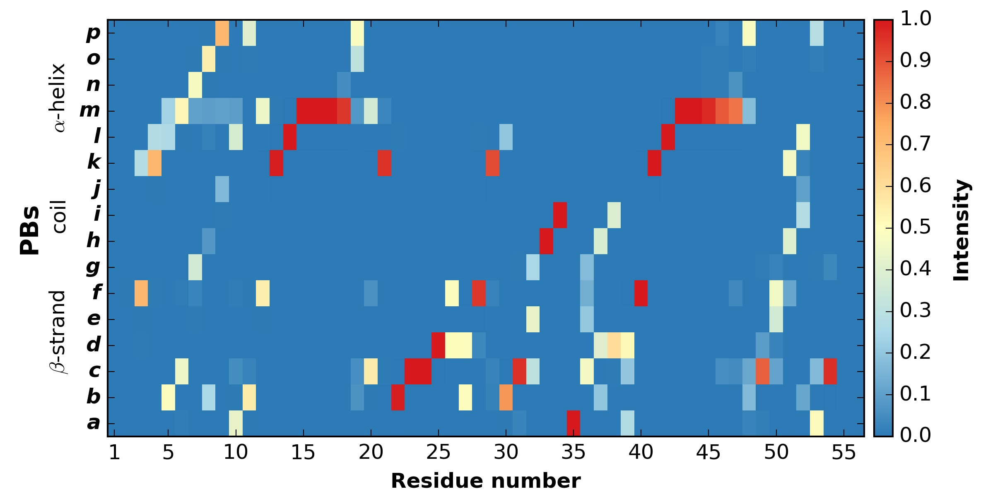
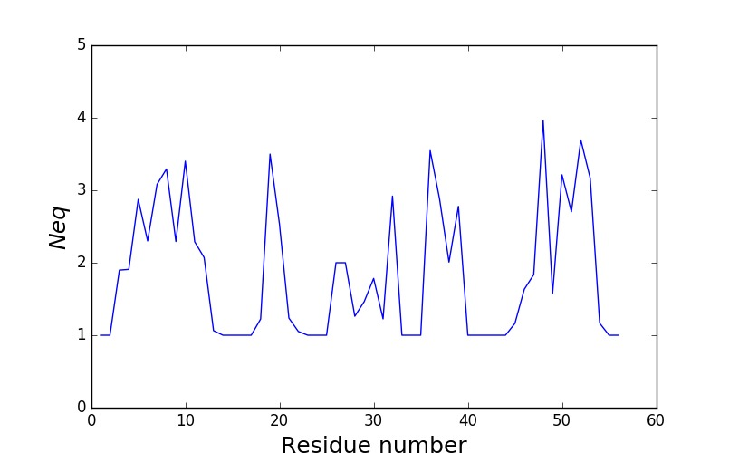
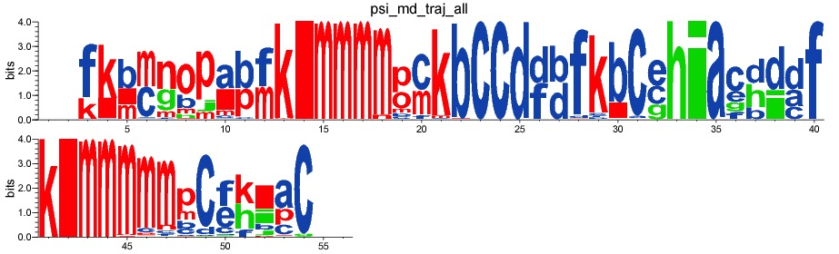
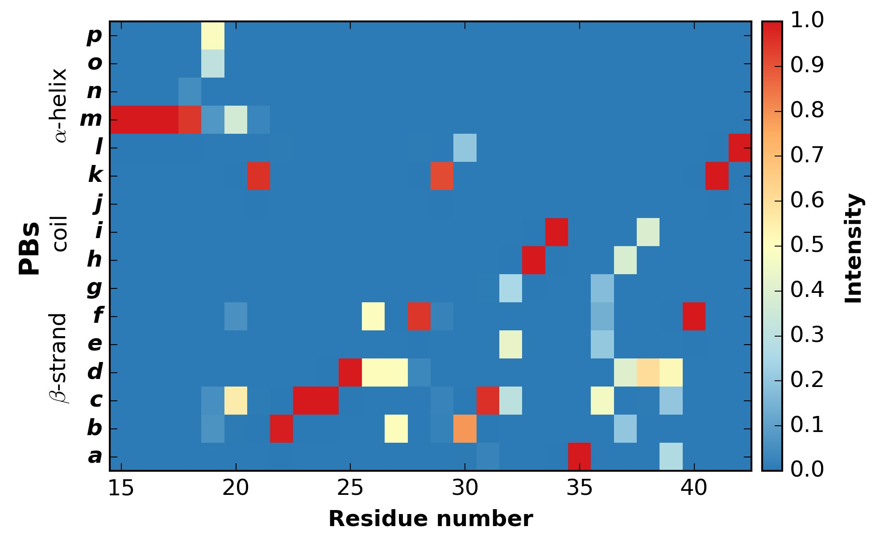
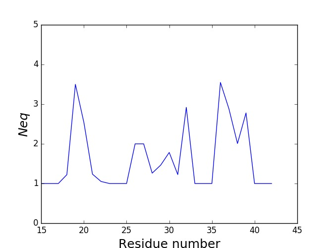
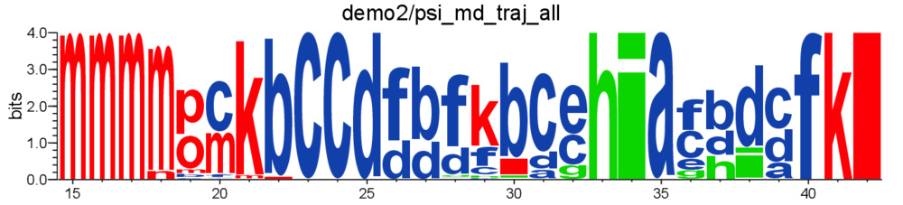

PBstat
======

``PBstat`` generates frequency and logo plots, and estimates something similar
to entropy called the equivalent number of PBs (:ref:`Neq <Neq>`).

.. note:: The following examples use ``PBdata`` and the demo files.
          See :ref:`Demo files <demo>` for more information.

.. warning:: To generate map or *Neq* plot, `Matplotlib <http://matplotlib.org/>`_ is required.

.. warning:: To generate Weblogo-like representations,
             `Weblogo3 <http://weblogo.threeplusone.com/>`_ is required.


Example
-------

.. code-block:: bash

    $ PBstat -f `PBdata`/psi_md_traj_all.PB.count --map --neq --logo -o psi_md_traj_all
    Index of first residue is: 1
    wrote psi_md_traj_all.PB.map.png
    wrote psi_md_traj_all.PB.Neq
    wrote psi_md_traj_all.PB.Neq.png
    wrote psi_md_traj_all.PB.logo.png


Usage
-----

Here’s the ``PBstat`` help text. ::

    usage: PBstat [-h] -f F -o O [--map] [--neq] [--logo]
                  [--image-format {pdf,png,jpg}] [--residue-min RESIDUE_MIN]
                  [--residue-max RESIDUE_MAX]

    Statistical analysis and graphical representations of PBs.

    optional arguments:
      -h, --help            show this help message and exit
      -f F                  name of file that contains PBs frequency (count)
      -o O                  name for results
      --map                 generate map of the distribution of PBs along protein
                            sequence
      --neq                 compute Neq and generate Neq plot along protein
                            sequence
      --logo                generate logo representation of PBs frequency along
                            protein sequence
      --image-format {pdf,png,jpg}
                            File format for all image output.
      --residue-min RESIDUE_MIN
                            defines lower bound of residue frame
      --residue-max RESIDUE_MAX
                            defines upper bound of residue frame


`--map` option
``````````````

generates map of the distribution of PBs along protein sequence.

.. warning:: This option requires `Matplotlib <http://matplotlib.org/>`_.

.. code-block:: bash

    $ PBstat -f `PBdata`/psi_md_traj_all.PB.count --map -o psi_md_traj_all
    Index of first residue is: 1
    wrote psi_md_traj_all.PB.map.png




    Distribution of PBs


The color range goes from red to blue. For a given position in the protein sequence,
blue corresponds to a null frequency (meaning the particular PB is never met a this position) and
red corresponds to a frequency of 1 (meaning the particular PB is always found at this position).

`--neq` option
``````````````

computes *Neq* and generates *Neq* plot along protein sequence.

.. warning:: This option requires `Matplotlib <http://matplotlib.org/>`_.

.. code-block:: bash

    $ PBstat -f `PBdata`/psi_md_traj_all.PB.count --neq -o psi_md_traj_all
    Index of first residue is: 1
    wrote psi_md_traj_all.PB.Neq
    wrote psi_md_traj_all.PB.Neq.png


Content of `psi_md_traj_all.PB.Neq`: ::

    resid       Neq
    1          1.00
    2          1.00
    3          2.03
    4          1.92
    5          3.12
    6          2.14
    [snip]




    Neq versus residue number


`--logo` option
```````````````

generates WebLogo-like representation of PBs frequency along protein sequence.

.. warning:: This option requires `Weblogo3 <http://weblogo.threeplusone.com/>`_.

.. code-block:: bash

    $ PBstat -f `PBdata`/psi_md_traj_all.PB.count --logo -o psi_md_traj_all
    Index of first residue is: 1
    wrote psi_md_traj_all.PB.logo.png




    Logo representation of PBs frequency


`--residue-min` and `--residue-max` options
```````````````````````````````````````````

These options define the lower and upper bound of residue frame.

.. code-block:: bash

    $ PBstat -f `PBdata`/psi_md_traj_all.PB.count --map --neq --logo -o psi_md_traj_all_frame --residue-min 15 --residue-max 42
    Index of first residue is: 1
    wrote psi_md_traj_all_frame.PB.map.15-42.png
    wrote psi_md_traj_all_frame.PB.Neq.15-42
    wrote psi_md_traj_all_frame.PB.Neq.15-42.png
    wrote psi_md_traj_all_frame.PB.logo.15-42.png




    PBs distribution with residue frame



    Neq versus residue number with residue frame



    Logo representation of PBs frequency


`--image-format` option
```````````````````````

All figure can be produced in either PNG, PDF, or JPEG format.
The `--image-format` option allows to control the file format of the image outputs.
